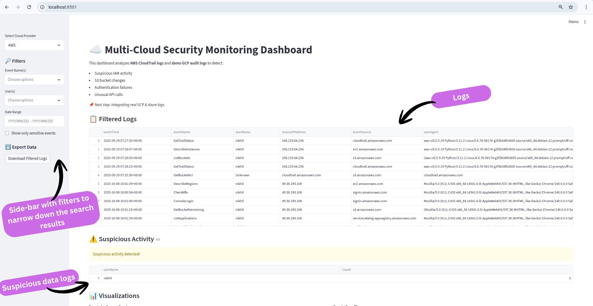
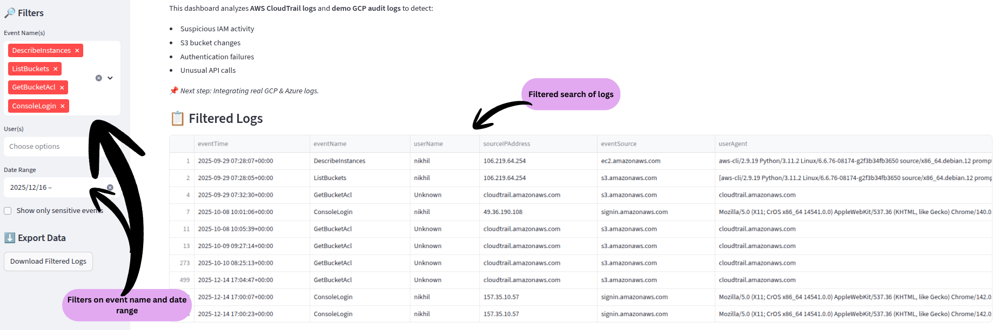
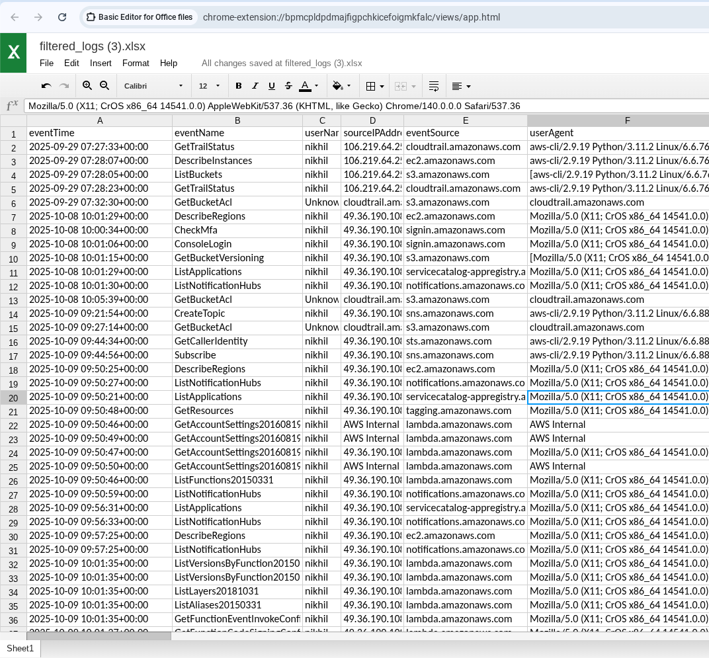

# ☁️ Multi-Cloud Security Monitoring Dashboard (AWS + GCP)

An interactive security monitoring dashboard that analyzes **AWS CloudTrail** and **GCP Audit Logs** to detect suspicious activity and visualize cloud events.

This project demonstrates how security logs from multiple cloud providers can be normalized and analyzed in a single dashboard, similar to real-world **SIEM systems**.

---

## 🚀 Features

- Detects suspicious cloud activity:
  - IAM permission changes
  - `DeleteBucket` operations
  - Failed authentication attempts
- Visual alerts for sensitive API actions
- Interactive Streamlit-based dashboard
- AWS CloudTrail log analysis (real logs)
- GCP Audit Log analysis (demo dataset)
- Time-based and service-based visualizations

---

## 📸 Dashboard Preview

### 🔹 Dashboard Overview
Displays a high-level summary of cloud activity across AWS and GCP, including total events and suspicious actions.



### 🔹 Filters & Alerts
Allows filtering logs by cloud provider, service, and event type.  
Highlights sensitive actions such as IAM changes and destructive API calls.



### 🔹 Filtered Logs
Shows normalized AWS and GCP logs in a structured table for investigation and analysis.



### 🔹 Visualizations
Charts showing event frequency over time and service-level activity to identify unusual behavior.


---

## 🏗️ Architecture Overview

```text
AWS CloudTrail Logs        GCP Audit Logs
        ↓                        ↓
        Normalized using Python
                    ↓
            Stored as CSV datasets
                    ↓
        Visualized using Streamlit Dashboard

```
---

## 🛠️ Tech Stack

- Python 3
- Streamlit
- Pandas
- AWS CloudTrail
- GCP Audit Logs

---
## 📂 Project Structure

```text
multi-cloud-monitor/
├── dashboard.py         # Streamlit dashboard
├── fetch_logs.py        # Log normalization & CSV generation
├── data/
│   ├── aws_logs.csv     # Real AWS CloudTrail logs
│   └── gcp_logs.csv     # Demo GCP Audit Logs
├── requirements.txt
├── README.md
├── venv/ 
```

## 📌 Data Sources

AWS:
⚠️ Note: AWS logs require valid AWS credentials. If unavailable, use demo GCP logs.
Real CloudTrail logs exported and normalized into CSV format.

GCP:
Demo Audit Log dataset used to simulate multi-cloud visibility.

This approach ensures consistent detection logic across cloud providers while keeping costs minimal.

---
## ▶️ How to Run Locally
1️⃣ Activate Virtual Environment
```bash
source venv/bin/activate
```

 2️⃣ Run the Dashboard
```bash 
streamlit run dashboard.py
```
 3️⃣ Open in Browser
http://localhost:8501

---

## 🚨 Security Detection Logic

The dashboard highlights:

- Sensitive API actions (DeleteBucket, IAM changes, etc.)

- Unusual activity frequency

- Potential misconfigurations

-  Suspicious cloud service usage

## 🔮 Future Enhancements

Real-time log ingestion (Pub/Sub / EventBridge)

Slack / Email alerting

Azure Activity Log integration

Threat severity scoring

Deployment on cloud hosting (Streamlit Cloud / EC2)

---

👨‍💻 Author

Nikhil Sharma
Cloud & Security Enthusiast
Amritsar, India


